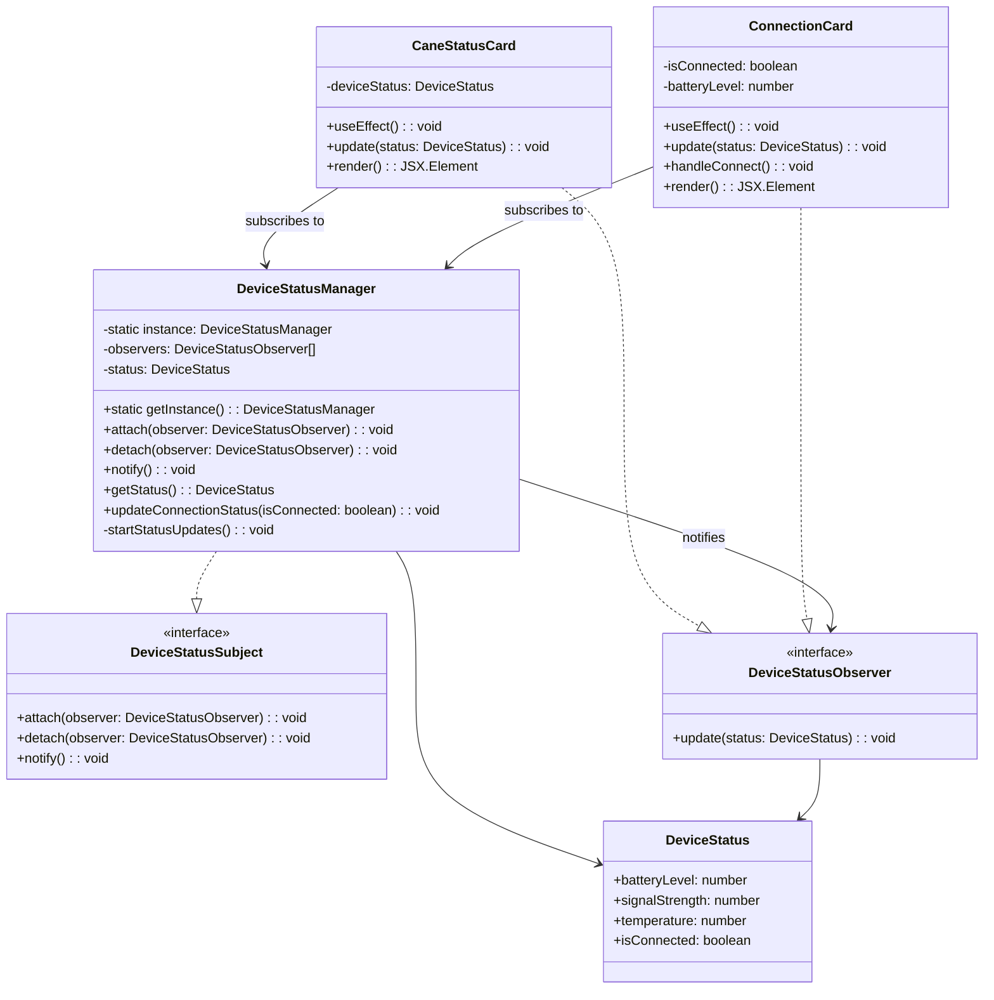

# Observer Pattern UML Diagram

## Pattern Implementation: Observer Pattern

### Components:
- **Subject Interface**: `DeviceStatusSubject` - defines contract for managing observers
- **Concrete Subject**: `DeviceStatusManager` - singleton that holds device status and manages observer list
- **Observer Interface**: `DeviceStatusObserver` - defines update contract for observers  
- **Concrete Observers**: `CaneStatusCard` and `ConnectionCard` - UI components that react to status changes
- **Data Model**: `DeviceStatus` - encapsulates device state information

### How It Works:
1. UI components subscribe to `DeviceStatusManager` during mounting
2. `DeviceStatusManager` automatically polls device status every 3 seconds when connected
3. When status changes, all subscribed observers are notified via `update()` method
4. UI components automatically re-render with new status data
5. Components unsubscribe when unmounting to prevent memory leaks